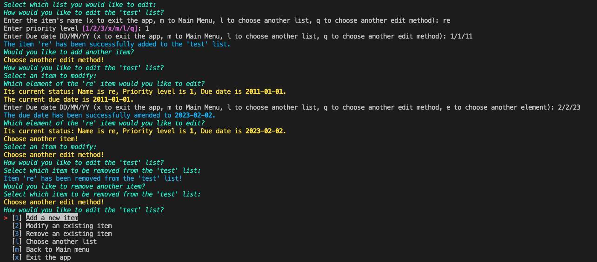

# Provide a link to your source control repository

https://github.com/Hanzhi11/Terminal_APP_HanzhiZhang_T1A3

# Provide a link to your presentation

https://youtu.be/IdAg2QKq2dw

# Code sources

datetime: Lib/datetime.py 

simple_term_menu: https://pypi.org/project/simple-term-menu/

Rich: https://rich.readthedocs.io/en/stable/introduction.html 

Pandas: https://pandas.pydata.org/

Pytest: https://docs.pytest.org/en/7.1.x/ 

# Identify any code style guide or styling conventions that the application will adhere to.

This code used PEP 8 [1] as code style guide.

[1] Guido van Rossum, Barry Warsaw, Nick Coghlan. (2013, Aug 1). PEP 8 – Style Guide for Python Code. Retrieved from https://peps.python.org/pep-0008/

# Develop a list of features that will be included in the application. It must include: at least THREE features & describe each feature

- Create a new to-do list: Allow users to create a new list with a case-insensitive list name and list items. Each item consists of case-insensitive item name, priority level and due date. During the create process, the users can exit the app or go back to the main menu at any time. However, the app doesn't allow the user to create a list with a name which is in the list collection already.

- Edit an existing list: Allow users to edit the existing list in the list collection. The users can add additional items to the list, modify the existing items in the list and remove the existing items from the list. Regards to item modification, the users can update the item's name, priority level and due date. During the edit, the users can exit the app, or go back to the main menu or to the upper level menu at any time.
  
- Delete an existing list. Allow users to delete the existing lists.
  
- View an existing list. Allow users to view the content of the list.

- Export the non-empty lists in the list collection. Allow users to export the non-empty lists created using the app.

# Develop an implementation plan which: (1) outlines how each feature will be implemented and a checklist of tasks for each feature; (2) prioritise the implementation of different features, or checklist items within a feature; (3) provide a deadline, duration or other time indicator for each feature or checklist/checklist-item

- Create a new to-do list:
  - Get user's input for the name of the list
  - Get user's inputs for the name, priority and due date of the item of the list
  - Validate user's input including duplicate check and quit check
  - Keep asking the user for a new input until the input becomes valid
  - Save user's input
  - Update the list collection once the user successfully creates a list including the list name and at least one item
  - Check if the user wants to add anothe item
  - Quit the app if requested
  - Go back to the main menu if requested

- Edit an existing list:
  - Check if the list collection is empty or not. If empty, ask the user to create one first.
  - Ask the user to select one list for edit
  - Check if the user wants to exit the app or go back
  - Exist the app if requested
  - Go back if requested including going back to the main menu
  - Ask the user to choose how to edit the selected list
    - Add an additional item to the selected list
      - Get user's input for the name of the new item
      - Get user's input for the priority level of the new item
      - Get user's input for the due date of the new item
      - Validate user's input including duplicate check and quit check
      - Keep asking the user for a new input until the input becomes valid
      - Add the new item to the selected list
      - Check if the user wants to add anothe item
      - Update the list collection
      - Quit the app if requested
      - Go back if requested including going back to the main menu
    - Modify an existing item in the selected list
      - empty list check
      - Select an item for modification
        - Change name
        - Change priority level
        - Change due date
      - update list collection
      - Quit check
      - Quit the app if requested
      - Go back if requested including going back to the main menu
    - Remove an existing item in the selected list
      - Empty list check
      - Select an item to remove
      - Remove the selected item from the list collection
      - Check if the user wants to remove another one
      - Quit the app if requested
      - Go back if requested including going back to the main menu
- Delete an existing list:
  - Empty list collection check
  - Select a list to delete
  - Delete the selected list from the list collection
  - Check if the user wants to delete another list
  - Quick the app if requested
  - Go back to the main menu if requested
- View an existing list:
  - Empty list collection check
  - Select a list to view
  - Display the selected list and Back to the main menu
  - Quick the app if requested
  - Go back to the main menu if requested
- Export non-empty lists
  - Empty list check
  - Ask the user to select if he/she wants to save and export the non-empty lists in the list collection
  - Yes or no check
  - Ask the user to enter file name
  - Validate user's input
  - Export the data

Link to Trello Board: https://trello.com/b/x4pdTBHv/t1a3

# Tests

- Tested the essential functions relating to the create a new to-do list feature using pytest
  - list_name_duplicate_check
  - item_duplicate_check
  - obtain_list_name
  - obtain_item_name
  - obtain_priority_level
  - date_convert_format
  - obtain_due_date
  - add_item

- Tested some essential functions relating to the edit an existing list feature using pytest
  - empty_list_check
  - empty_list_collection_check
  - update_collection
  - update_item_name
  - remove_item

- Tested some quit functions using pytest
  - exit_app
  - exit_main_check
  - back_to_upper_menu_check
  - back_to_edit_menu_check
  - select_another_element
  
Please refer to test.py for the pytest code and test_result.txt for the test report.

# Design help documentation which includes a set of instructions which accurately describe how to use and install the application.

- Compatibility

  This app supports MacOS and Linux systems only.

- How to install and open the app
  1. Download the whole repo in ZIP format
  2. Open the downloaded ZIP file
  3. Change your terminal's working directory to 'HanzhiZhang_T1A3-main' which contains the run.sh file
  4. Enter 'chmod u+x run.sh' on the terminal
  5. Install the app with 'bash run.sh'

- How to use

  

  - Create a new to-do list
    1. Select 'Create a new list' on the main menu using up or down arrow key + enter or by entering the shortcut of '1'.
    2. Enter the name of the new list(case insensitive). Enter 'x' to exit the app or 'm' to back to the main menu.
    3. Enter the name of the item for the list (case insensitive). Enter 'x' to exit the app or 'm' to back to the main menu.
    4. Enter the priority level of the item. 1 for low, 2 for medium and 3 for high. Enter 'x' to exit the app or 'm' to back to the main menu.
    5. Enter the due date of the item in the format of DD/MM/YY. Enter 'x' to exit the app or 'm' to back to the main menu.
    6. Use up or down arrow keys + enter or enter the shortcut key at the front the option to select if you would like to add another item.
    Notes:
       - A new list would be saved only if you successfully add AT LEAST one item to the list. You will see a message 'The item '{item name}' has been successfully added to the '{item name}' list.' to confirm the item has been added to the list successfully.
       - An item would be saved only if you provide all of the information on the name, priority and due date of the item.

    

  - Edit an existing list
    1. Select 'Edit an existing list' on the main menu using up or down arrow key + enter or by entering the shortcut of '2'.
    2. Select a list you would like to edit using up or down arrow key + enter or by entering the number at the front of the list name.
    3. Select a edit method using up or down arrow key + enter or by entering the number at the front of the method.
    - Add an additional item to a list
      1. Enter the name of the item (case insensitive). Enter 'x' to exit the app, 'm' to back to the main menu, 'l' to choose another list or 'q' to choose another edit method.
      2. Enter the priority level of the item. 1 for low, 2 for medium and 3 for high. Enter 'x' to exit the app, 'm' to back to the main menu, 'l' to choose another list or 'q' to choose another edit method.
      3. Enter the due date of the item in the format of DD/MM/YY. Enter 'x' to exit the app, 'm' to back to the main menu, 'l' to choose another list or 'q' to choose another edit method.
      4. Use up or down arrow keys + enter or enter the shortcut key at the front the option to select if you would like to add another item.
      Note:
        - An item would be saved and added to the list only if you provide all of the information on the name, priority and due date of the item. You will see a message 'The item '{item name}' has been successfully added to the '{item name}' list.' to confirm the item has been added to the list successfully.
  
    - Modify the name of an existing item
      1. Select an item to modify using up or down arrow key + enter or by entering the number at the front of the item.
      2. Select an element of the item to edit using up or down arrow key + enter or by entering the number at the front of the element.
       - Name: Enter the new name (case insensitive). Enter 'x' to exit the app, 'm' to back to the main menu, 'l' to choose another list, 'q' to choose another edit method, or 'e' to choose another element.
       - Priority: Enter the new priority level. 1 for low, 2 for medium and 3 for high. Enter 'x' to exit the app, 'm' to back to the main menu, 'l' to choose another list or 'q' to choose another edit method, or 'e' to choose another element.
       - Due date: Enter the due date of the item in the format of DD/MM/YY. Enter 'x' to exit the app, 'm' to back to the main menu, 'l' to choose another list or 'q' to choose another edit method, or 'e' to choose another element.

    - Remove an existing item from a list:
      - Enter the number at the front of the item, or use up or down arrow key + enter to remove the item.
      - Use up or down arrow keys + enter or enter the shortcut key at the front the option to select if you would like to remove another item.

    

  - Delete an existing list
    1. Select 'Delete an existing list' on the main menu using up or down arrow key + enter or by entering the shortcut of '3'.
    2. Enter the number at the front of the list, or use up or down arrow key + enter to delete the list.
    3. Use up or down arrow keys + enter or enter the shortcut key at the front the option to select if you would like to delete another list.

    

  - View an existing list
    1. Select 'View an existing list' on the main menu using up or down arrow key + enter or by entering the shortcut of '4'.
    2. Enter the number at the front of the list, or use up or down arrow key + enter to display the list.
    Note:
     - The items are sorted by their due date in descending order. When two items have the same due date, these two items will be sorted by their priority level in descending order.
     - High priority level is indicated by a red bar, medium level by a yellow bar and low level by a green bar.
     - The due date is displayed in a red color if the due date is earlier than today, otherwise in a green color.
  
    

  Notes:
    Once you select to exit the app, if there is at least one non-empty list in the list collection, you will be asked to select if you would like to save and export all non-empty lists in the list collection. If you select yes, you will be asked to enter a file name. Then, all the non-empty lists that you have created will be exported to an excel file using your input as the file name in your working directory. Otherwise, you exit the app straight away.

    
